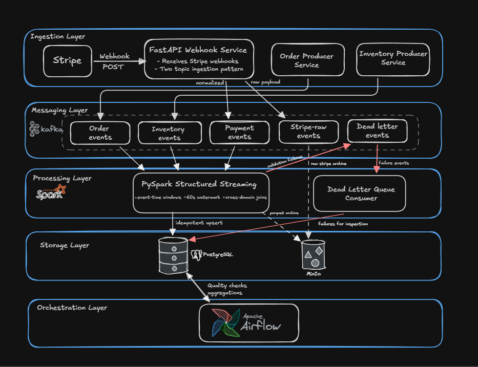

# realtime-ecommerce-reconciliation

Operational event reconciliation pipeline that detects and repairs state divergence between orders, payments, and inventory services.

The system ingests real Stripe webhook events, simulates upstream failures, and reconciles cross-domain state using a streaming processing layer.

---

## Problem

In e-commerce systems, domain services emit events independently:

- order service
- payment provider (Stripe)
- inventory service

Failures cause inconsistent system state:

| Scenario | Result |
|---|---|
| Stripe retries webhook | duplicate payment events |
| Order service crashes | payment exists but order missing |
| Inventory update delayed | item sold but stock not reserved |
| Malformed payload | event silently dropped or pipeline stall |

Manual reconciliation becomes operationally expensive at scale.
This project implements a streaming reconciliation pipeline that detects 
and resolves these inconsistencies automatically.

---

## System Overview

Three event streams feed the pipeline:
```
order-events
inventory-events  
payment-events
```

Stripe webhooks use a two-stage ingestion pattern:
```
Stripe webhook
      ↓
stripe-raw-events   ← immutable, never mutated
      ↓
normalisation layer (FastAPI → Kafka)
      ↓
payment-events      ← transformed to internal schema
```

This separation ensures replay always starts from source truth.
If normalisation logic has a bug, stripe-raw-events is untouched.

---

## Architecture


---

## Design Decisions

### Raw Event Preservation

Stripe payloads are written to `stripe-raw-events` before any transformation.

- enables deterministic replay from source truth
- preserves original payload for auditing
- isolates normalisation bugs from raw data

### Two-Topic Ingestion Pattern
```
stripe-raw-events  →  normalisation  →  payment-events
```

Separates transport format from processing format.
Schema changes in either direction do not corrupt the other layer.

### Dead Letter Queue

Malformed or unprocessable events are routed to `dead-letter-events`
and persisted in PostgreSQL for inspection and replay.

Prevents a single bad event from stalling the pipeline.

### Fault Injection

Producers simulate real-world failure conditions:

| Producer | Fault Rate | Fault Types |
|---|---|---|
| Order | 5% | missing fields, invalid amounts, bad schema versions |
| Inventory | 3% | missing SKU, string-typed quantities, bad timestamps |
| Payment | 8% | duplicate webhooks (5%), missing IDs, future timestamps |

Used to validate pipeline robustness under realistic conditions.

---

## Event Flow

1. Order created → `order-events`
2. Stripe payment succeeds → webhook received by FastAPI
3. Raw payload written to `stripe-raw-events` (immutable)
4. Payload normalised → `payment-events` (cents→dollars, unix→ISO 8601)
5. Inventory updated → `inventory-events`
6. PySpark streaming job joins all three streams on 60s event-time window
7. Reconciled state written to PostgreSQL via idempotent upsert
8. Airflow runs daily quality checks and DLQ trend analysis

---

## Repository Structure
```
realtime-ecommerce-reconciliation/
├── docker-compose.yml
├── Makefile
├── requirements.txt
├── .env.example
├── infra/
│   ├── kafka/create-topics.sh
│   └── postgres/migrations/001_init.sql
├── producers/
│   ├── base_producer.py
│   ├── order_producer.py
│   └── inventory_producer.py
├── consumers/
│   ├── stripe_receiver.py
│   └── dlq_consumer.py
├── spark/                        ← in progress
│   ├── schemas.py
│   ├── validators.py
│   ├── reconciler.py
│   ├── sinks.py
│   └── streaming_job.py
└── tests/
```

---

## Running Locally

**Prerequisites:** Docker Desktop, Python 3.11+, Stripe CLI, WSL2 (Windows)

### Start infrastructure
```bash
docker compose up -d
make topics
make status
```

### Install dependencies
```bash
python3 -m venv venv && source venv/bin/activate
pip install -r requirements.txt
```

### Configure environment
```bash
cp .env.example .env
# Set STRIPE_WEBHOOK_SECRET — get it from:
stripe listen --print-secret
```

### Run producers
```bash
# Terminal 1
PYTHONPATH=. python producers/order_producer.py

# Terminal 2
PYTHONPATH=. python producers/inventory_producer.py
```

### Run Stripe webhook receiver
```bash
# Terminal 3
PYTHONPATH=. python -m consumers.stripe_receiver

# Terminal 4 — forward real Stripe events to local server
stripe listen --forward-to localhost:8000/webhook

# Terminal 5 — trigger test events
stripe trigger payment_intent.succeeded
stripe trigger payment_intent.payment_failed
stripe trigger charge.dispute.created
```

---

## Roadmap

1. **PySpark streaming job** — cross-domain reconciliation, watermarked joins, SLA tracking
2. **Airflow DAGs** — daily quality checks, row count reconciliation, DLQ trend alerting
3. **Replay pipeline** — reprocess any time window from `stripe-raw-events` S3 archive
4. **Reconciliation dashboard** — consumer lag, DLQ depth, SLA violation rate in real time
5. **Exactly-once semantics** — evaluate Kafka EOS vs idempotent sink tradeoffs at scale